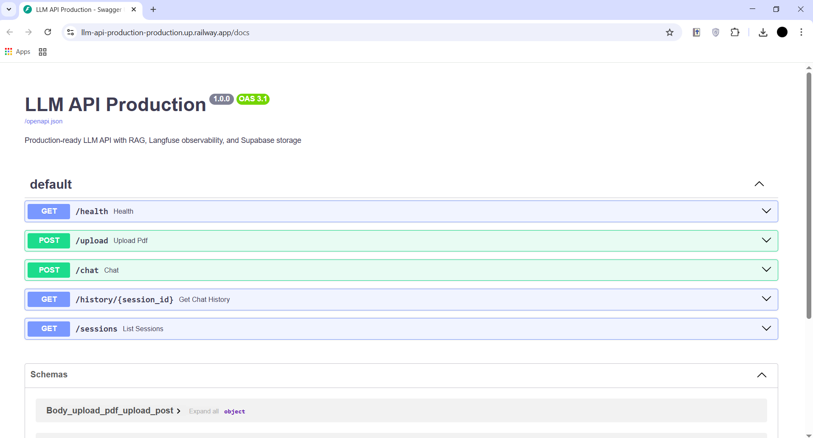
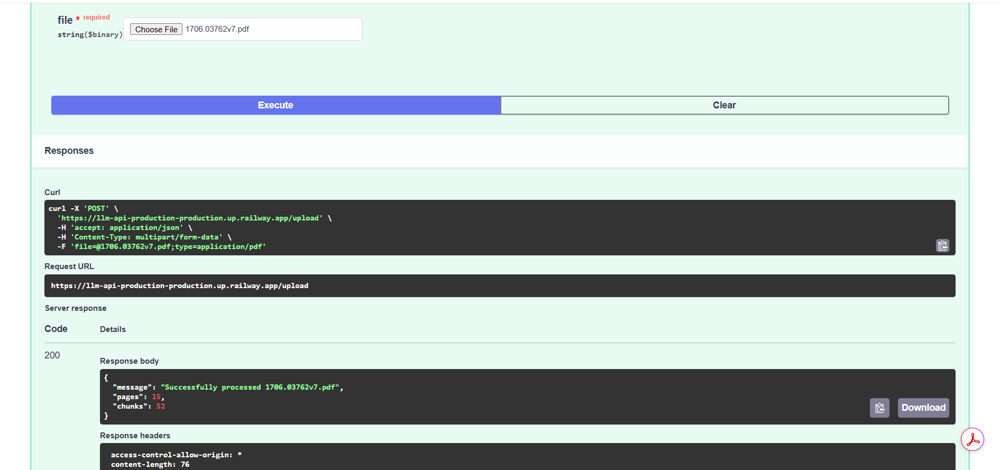
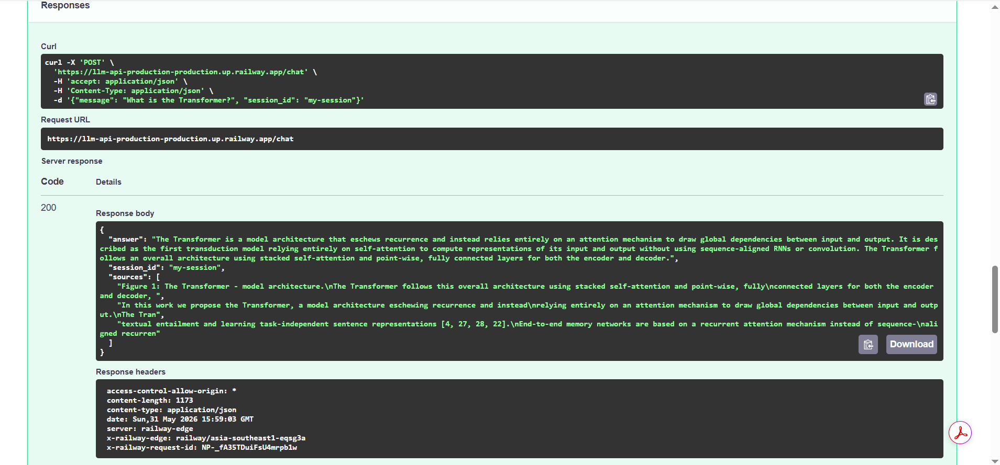
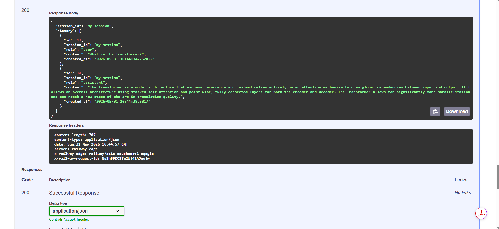
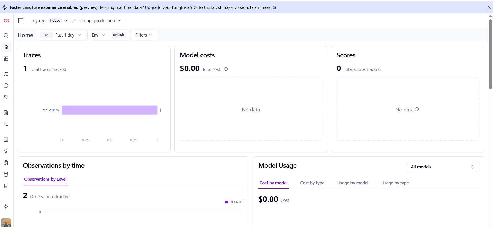

# LLM API Production

A production-ready LLM API with **FastAPI**, **RAG (Retrieval-Augmented Generation)**, **Langfuse observability**, and **Supabase** persistent storage — deployed on Railway.

🚀 **Live API:** https://llm-api-production-production.up.railway.app/docs

---

## What It Does

Upload any PDF document and ask questions about it. Every conversation is saved to a database, and every LLM call is traced for observability.

```
User uploads PDF
        ↓
API extracts text → splits into chunks → embeds with Gemini
        ↓
User asks a question
        ↓
API retrieves relevant chunks → sends to Gemini → returns answer
        ↓
Conversation saved to Supabase → trace logged to Langfuse
```

---

## Demo

[]
[]
[]
[]
[]

---

## API Endpoints

| Method | Endpoint | Description |
|--------|----------|-------------|
| GET | `/health` | Health check |
| POST | `/upload` | Upload and process a PDF |
| POST | `/chat` | Ask a question about the uploaded PDF |
| GET | `/history/{session_id}` | Retrieve chat history for a session |
| GET | `/sessions` | List all chat sessions |

---

## Example Usage

**Upload a PDF:**
```bash
curl -X POST https://llm-api-production-production.up.railway.app/upload \
  -F "file=@document.pdf"
```

Response:
```json
{
  "message": "Successfully processed document.pdf",
  "pages": 15,
  "chunks": 52
}
```

**Ask a question:**
```bash
curl -X POST https://llm-api-production-production.up.railway.app/chat \
  -H "Content-Type: application/json" \
  -d '{"message": "What is the Transformer?", "session_id": "my-session"}'
```

Response:
```json
{
  "answer": "The Transformer is a model architecture that eschews recurrence and instead relies entirely on an attention mechanism...",
  "session_id": "my-session",
  "sources": ["...relevant chunk 1...", "...relevant chunk 2..."]
}
```

**Get chat history:**
```bash
curl https://llm-api-production-production.up.railway.app/history/my-session
```

---

## Tech Stack

- **FastAPI** — REST API framework with automatic Swagger docs
- **LangChain** — RAG pipeline and LLM integration
- **Google Gemini** — LLM for answering questions + embeddings
- **ChromaDB** — Vector database for storing document embeddings
- **Langfuse** — LLM observability and tracing
- **Supabase** — PostgreSQL database for persistent chat history
- **Railway** — Cloud deployment platform
- **Python-dotenv** — Environment variable management

---

## Architecture

```
POST /upload
    ↓
PyPDFLoader → RecursiveCharacterTextSplitter
    ↓
GeminiEmbeddings (gemini-embedding-001)
    ↓
ChromaDB (vector store)

POST /chat
    ↓
ChromaDB retriever (top 3 chunks)
    ↓
Gemini (gemini-2.5-flash) → answer
    ↓
Supabase (save user + assistant messages)
    ↓
Langfuse (log trace)
```

---

## File Structure

```
llm-api-production/
├── main.py          # FastAPI app and endpoints
├── rag.py           # RAG logic with Langfuse tracing
├── database.py      # Supabase chat history
├── schemas.py       # Pydantic request/response models
├── requirements.txt # Dependencies
├── .python-version  # Python 3.12 for Railway
├── .env             # API keys (not on GitHub)
└── .gitignore
```

---

## Key Concepts

| Concept | What It Means |
|---------|--------------|
| RAG | Retrieve relevant document chunks before asking the LLM — reduces hallucinations |
| Vector embeddings | Text converted to numbers so similarity search works |
| ChromaDB | Local vector store — stores and retrieves embeddings |
| Langfuse | Logs every LLM call with inputs, outputs, latency, and cost |
| Supabase | Cloud PostgreSQL — persists chat history across sessions |
| Session ID | Groups messages together so history is retrievable per user |

---

## Run Locally

```bash
# Clone the repo
git clone https://github.com/richardy-lobo-sapan/llm-api-production.git
cd llm-api-production

# Create virtual environment
python -m venv venv
venv\Scripts\activate  # Windows
source venv/bin/activate  # Mac/Linux

# Install greenlet first (Windows)
pip install greenlet --only-binary=:all:

# Install dependencies
pip install -r requirements.txt

# Create .env file
GOOGLE_API_KEY=your_gemini_key
LANGFUSE_PUBLIC_KEY=your_langfuse_public_key
LANGFUSE_SECRET_KEY=your_langfuse_secret_key
LANGFUSE_HOST=https://us.cloud.langfuse.com
SUPABASE_URL=your_supabase_url
SUPABASE_KEY=your_supabase_key

# Run the API
uvicorn main:app --reload

# Open docs
http://127.0.0.1:8000/docs
```

Get free API keys:
- Gemini: https://aistudio.google.com/apikey
- Langfuse: https://us.cloud.langfuse.com
- Supabase: https://supabase.com

---

## What Makes This Production-Ready

| Feature | Why It Matters |
|---------|---------------|
| Persistent storage | Chat history survives server restarts |
| Observability | Every LLM call is traceable — debug and monitor in production |
| Session management | Multiple users can have separate conversations |
| Error handling | API returns proper HTTP errors instead of crashing |
| CORS middleware | Frontend apps can call the API from any domain |
| Docker-compatible | Runs consistently across environments |
| CI/CD via Railway | Auto-deploys on every git push |

---

## Author

**Richardy Lobo' Sapan**
- GitHub: [@richardy-lobo-sapan](https://github.com/richardy-lobo-sapan)
- LinkedIn: [richardylobosapan](https://www.linkedin.com/in/richardylobosapan/)
